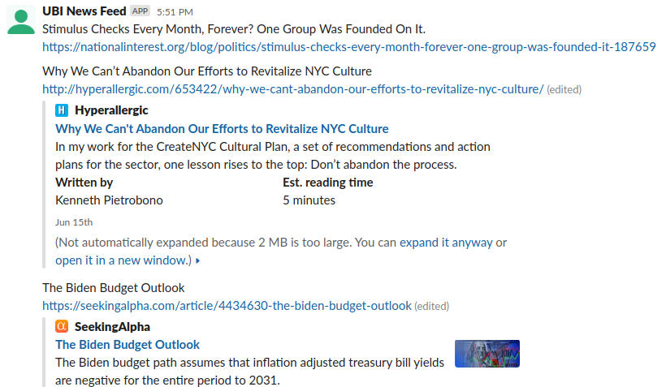

# UBI News Bot

A robot that automatically collects news about UBI and to your Slack channel everyday.



The repository is built for UBI Taiwan. If you want to build your own version, please follow the steps as below.

## Build Your Own Bot on Slack

* Clone the repository.

* Create a Heroku app for Node.js ([tutorial](https://devcenter.heroku.com/articles/getting-started-with-nodejs)). Please make sure the Heroku app is bind with your cloned repository.

* Register [News API](https://newsapi.org/) and get a News API key.

* In your Slack workspace, create a channel named `ubi-news-feed`.

* Create a new Slack app and get a Slack token ([tutorial](https://slack.dev/node-slack-sdk/getting-started)).

* Invite the Slack app to `ubi-news-feed` channel.

* Edit the value of `heroku.host` in `config.js` as your Heroku app host and apply git commit for the change.

* Edit the value of `news.keywords` in `config.js` as your keywords for UBI and apply git commit for the change.

* Set News API key and Slack app token in your Heroku app by running:

```bash
heroku config:set NEWS_API_KEY=YOUR$_NEWS_API_KEY && heroku config:set SLACK_TOKEN=YOUR_SLACK_TOKEN
```

* Everything is done. Now you can receive news (if available) on 13:00 (GMT/UTC+0) / 21:00 (Taipei Time) everyday!
